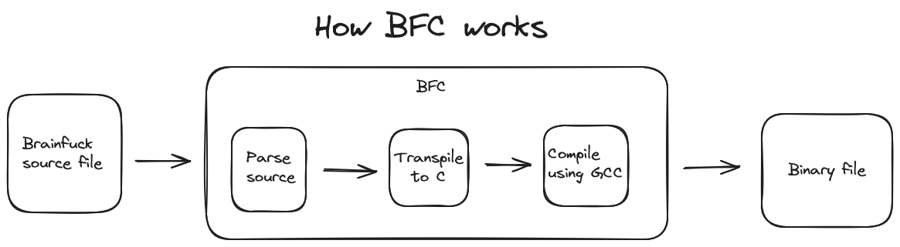

# BFC v1.1.1
* Brainfuck compiler

## How it works


## Building

* Clone the repo
```sh
git clone https://github.com/Tacomies/brainfuck/
```

* Using [CMake](https://cmake.org/download/) and [Make](https://www.gnu.org/software/make/)

```sh
mkdir build
cd build 
cmake .. (On Windows add: -G "Unix Makefiles")
make
```

* Manually

```sh
g++ -c src/loader.cpp
g++ -c src/transpiler.cpp
g++ -o bfc src/main.cpp loader.o transpiler.o
rm loader.o transpiler.o 
```

## Usage

```sh
bfc <source file path> <destination path>
```

## Dependencies
* [GCC](https://gcc.gnu.org/) is required for BFC to work

### Good to know
* I can't get myself to write Brainfuck, meaning that testing is pretty limited and it could very well mean that something I say works is in fact broken
